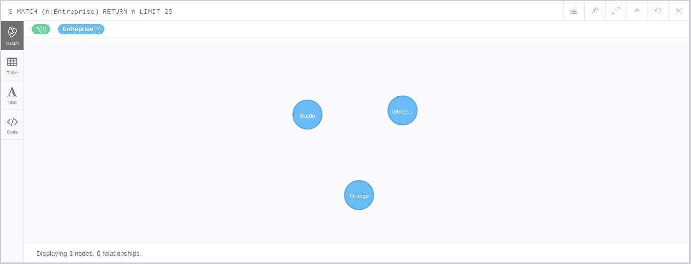

# Neo4j

## Description du sujet

### Modéliser dans Neo4j un « LinkedIn-like » :

**Des Entreprises :**
* Nom
* Secteur d’activité
* Description
* Taille

**Des Utilisateurs :**
* Nom, Prénom
* Description
* Liste des compétences

**Relations Utilisateurs - Entreprise :**
* « A travaillé pour »
* Du … au …
* En tant que … (salarié, sous-traitant)
  
**Relations Utilisateurs – Utilisateurs :**
* « A travaillé avec »
* « Connait »

### Exprimer les requêtes d’insertion   
* D’entreprises  
* D’utilisateurs  
* De relations 

### Mettre en place le nécessaire pour des requêtes de recherche d’entreprises ou d’utilisateurs par nom.

### Exprimer ces requêtes de recherche par nom.

### Exprimer des requêtes de suggestions de relations
* Utilisateurs ayant travaillé en même temps (qu’un utilisateur donné dans une entreprise donnée)
* Utilisateurs connus par les connaissances d’un utilisateur donné


## Scripts Neo4j

### Structure de données

#### Nœud (Entreprise et Utilisateur)
```CQL
# Nœud d'entreprise
(e_x:Entreprise {nom: "nom d'entreprise", secteur: "secteur d’activité", description: "description d'entreprise", taille: effectif})

# Nœud d'utilisateur
(u_x:Utilisateur {nom: "nom d'utilisateur", prenom: "prenom d'utilisateur", description: "description d'utilisateur", liste_competence: "competence1 competence2 ..."})
```

#### Relation
```CQL
# Relation parmi des entreprises et utilisateurs
-[r_eu_x:Travailler_Pour {pendant: ["du xx/xx/xx au xx/xx/xx"], titre: ["titre d'utilisateur dans l'entreprese"]}]->

# Relation parmi des utilisateurs
-[r_uu_x:Travailler_Avec]->
-[r_uu_x:Connait]->
```

### Exprimer les requêtes d’insertion
```CQL
# Creer 2 nœuds d'entreprise
CREATE(e_0:Entreprise {nom: "Orange", secteur: "telecommunication", description: "une entreprise communication", taille: 1000});

CREATE(e_1:Entreprise {nom: "telecom-st-etienne", secteur: "education", description: "une ecole d'ingenieur de telecommunication", taille: 200});

CREATE(e_2:Entreprise {nom: "Baidu", secteur: "IT", description: "une entreprise engage dans la domaine IT", taille: 1000});
```


```CQL
# Creer 2 nœuds d'utilisateur
CREATE(u_0:Utilisateur{nom:"LU", prenom:"Yi",description:"une etudiante FISE3", liste_competence:"Neo4j Cassandra"});

CREATE(u_1:Utilisateur{nom:"HE", prenom:"Chen",description:"un etudiant FISE3", liste_competence:"MongoDB Redis"});

CREATE(u_2:Utilisateur{nom:"GIRODON", prenom:"Remy",description:"l'enseignant de NoSQL", liste_competence:"MongoDB Redis Neo4j Cassandra"});
```


```CQL
# Creer les relations parmi des entreprises et utilisateurs
MATCH(u:Utilisateur{nom:"HE", prenom:"Chen"})
MATCH(e:Entreprise{nom:"Orange"}) CREATE (u)-[r_eu_x:Travailler_Pour {pendant: ["du 01/03/19 au 31/08/19"], titre: ["stagiaire"]}]->(e);

MATCH(u:Utilisateur{nom:"LU", prenom:"Yi"})
MATCH(e:Entreprise{nom:"Baidu"}) CREATE (u)-[r_eu_x:Travailler_Pour {pendant: ["du 01/03/19 au 31/08/19"], titre: ["stagiaire"]}]->(e);

MATCH(u:Utilisateur{nom:"GIRODON", prenom:"Remy"})
MATCH(e:Entreprise{nom:"telecom-st-etienne"}) CREATE (u)-[r_eu_x:Travailler_Pour {pendant: ["du 01/09/18 au 20/02/19"], titre: ["stagiaire"]}]->(e);
```


```CQL
# Creer les relations parmi des utilisateurs (« Connait »):
MATCH(u0:Utilisateur{nom:"HE", prenom:"Chen"}) 
MATCH(u1:Utilisateur{nom:"GIRODON", prenom:"Remy"}) CREATE (u0)-[r_uu_x:Connait]->(u1);

MATCH(u0:Utilisateur{nom:"LU", prenom:"Yi"}) 
MATCH(u1:Utilisateur{nom:"GIRODON", prenom:"Remy"}) CREATE (u0)-[r_uu_x:Connait]->(u1);


# Creer les relations parmi des utilisateurs (« Travailler_Avec »):
MATCH(u0:Utilisateur{nom:"LU", prenom:"Yi"}) 
MATCH(u1:Utilisateur{nom:"HE", prenom:"Chen"}) CREATE (u0)-[r_uu_x:Travailler_Avec]->(u1);
```


### Mettre en place le nécessaire pour des requêtes de recherche
```CQL
# Ajouter l'indice sur nom pour 2 types de nœuds pour faciliter des opérations recherche
CREATE INDEX ON :Entreprise(nom);
CREATE INDEX ON :Utilisateur(nom);
```

### Exprimer ces requêtes de recherche par nom
```CQL
# Quelques examples des requêtes de recherche:
MATCH (e:Entreprise) WHERE e.nom STARTS WITH "LU" RETURN e;
MATCH (e:Entreprise) WHERE e.nom ENDS WITH "en" RETURN e;

MATCH (u:Utilisateur) WHERE u.nom CONTAINS "UN" RETURN u;
MATCH (u:Utilisateur) WHERE u.nom =~ "(?i)GI.*" RETURN u;
```

### Exprimer des requêtes de suggestions de relations
```CQL
# Utilisateurs ayant travaillé en même temps
MATCH(e:Entreprise{nom:"telecom-st-etienne"}) CREATE (u:Utilisateur{nom:"LACLAU", prenom:"Charlotte"})-[r_eu_x:Travailler_Pour {pendant: ["du 01/09/18 au 20/02/19"], titre: ["enseignant"]}]->(e);

MATCH(e:Entreprise{nom:"telecom-st-etienne"}) CREATE (u:Utilisateur{nom:"SUBERCAZE", prenom:"Julien"})-[r_eu_x:Travailler_Pour {pendant: ["du 01/09/18 au 20/02/19"], titre: ["enseignant"]}]->(e);

MATCH (u)-[r]->() MATCH ({nom:"LACLAU"})-[R:Travailler_Pour]->({nom:"telecom-st-etienne"}) WHERE r.pendant=R.pendant RETURN u;

# Utilisateurs connus par les connaissances d’un utilisateur donné
MATCH (u) WHERE (u)-[:Connait]->({nom: "GIRODON"}) RETURN u;
```
